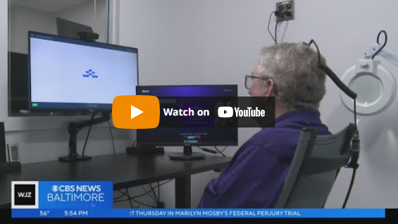

I'm Steve, a Biomedical Engineering Ph.D. student at [Johns Hopkins University](https://www.bme.jhu.edu/). My research interest lies in the application of machine learning for speech brain computer interfaces.  

I am advised by [Nathan Crone](https://cronelab.github.io/) and currently working on a [clinical trial](https://www.hopkinsmedicine.org/neurology-neurosurgery/clinical-trials/brain-computer-interface) investigating the safety and efficacy of implanted electrocorticography grids. To gain more experience in speech processing, I also spent a year working primarily from [Hynek Hermansky](https://engineering.jhu.edu/faculty/hynek-hermansky/)'s lab at the [Center for Language and Speech Processing](https://www.clsp.jhu.edu/). 

Outside of the lab, I enjoy distance running, skiing, and baking.

---
# Media reports about my work

Johns Hopkins researchers use brain-computer interface to improve lives of ALS patients (WJZ)

      
    

 
Creating more independence for those living with ALS (Investigative TV)

      
    
